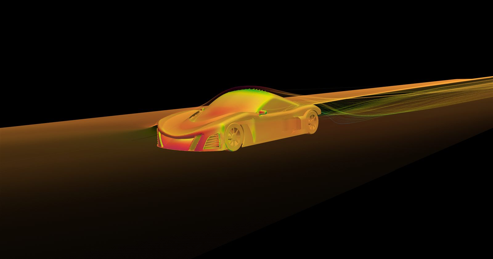
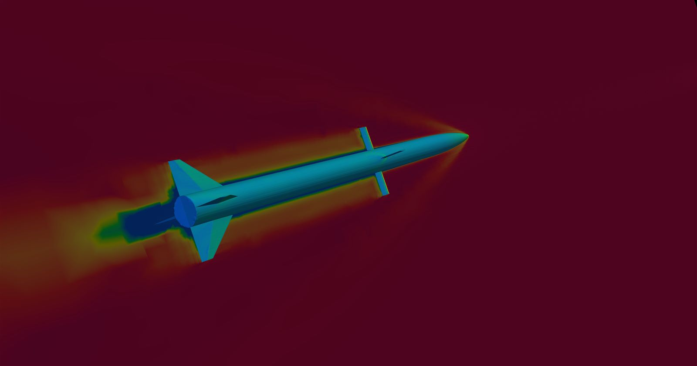

# CFD Portfolio

Three CFD case studies (race car external aero, supersonic missile aero,
Subaru Outback aero), each with full technical writeups and the underlying
OpenFOAM case files.

- [Race Car External Aero — GPU-Accelerated RANS/PIMPLE](racecarAero/)
- [Supersonic Missile Aerodynamics — Mach 3.8115](superSonic/)
- [Subaru Outback (2022) — Automotive External Aero](subaruOutback/)

