# Race Car External Aerodynamics — GPU-Accelerated RANS/PIMPLE

Half-car symmetry-plane simulation of a full aero package (vortex generators,
underbody diffuser, engine intake, sidepods) at 50 m/s, OpenFOAM v2512, GPU
pressure solve.

| Cd | Cl | Freestream | Turbulence | Cores |
|---|---|---|---|---|
| 0.278 | -0.180 | 50 m/s | k-ω SST | 12 |

## Problem & Goal

Full aero simulation of a race car half-model (symmetry plane at X = 0) at
50 m/s: front/rear wheels (rotating-wall BC), mirrors, front splitter vent,
side skirt, six roof-mounted vortex generators, engine intake, underbody
diffuser strake, rear spoiler. Goal: steady-state Cd/Cl baseline, then a
transient follow-up once the wake proved unsteady.

## Geometry

CAD source model (Fusion 360) for the CFD surface geometry.

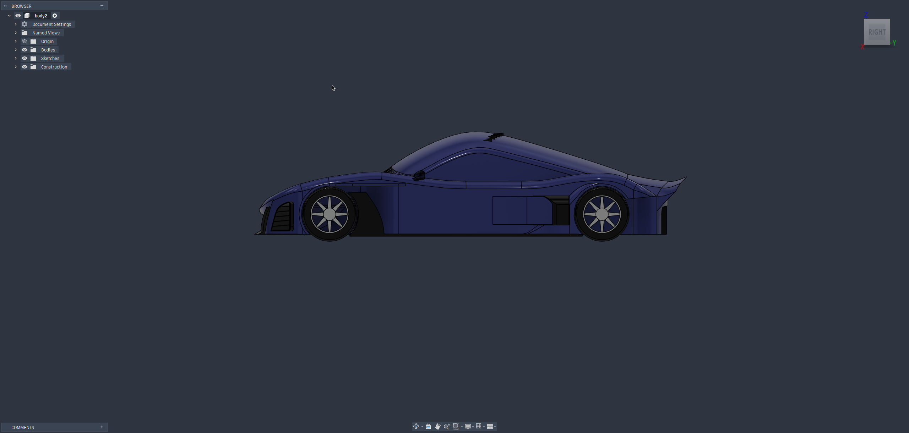

*Side view: full profile, roofline, side intake vents, wheels, rear wing.*

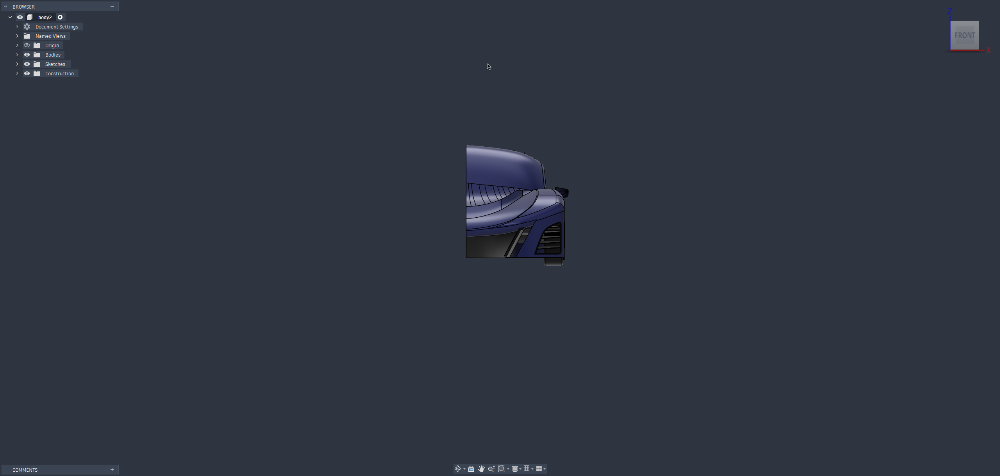

*Front view: hood, windshield, front splitter/vent detail.*

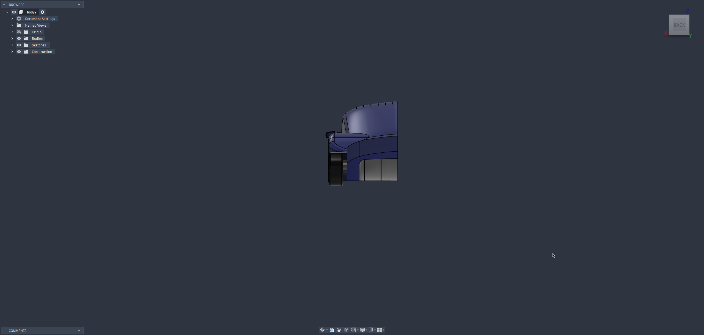

*Rear view: rear wing profile, wheel, side vent.*

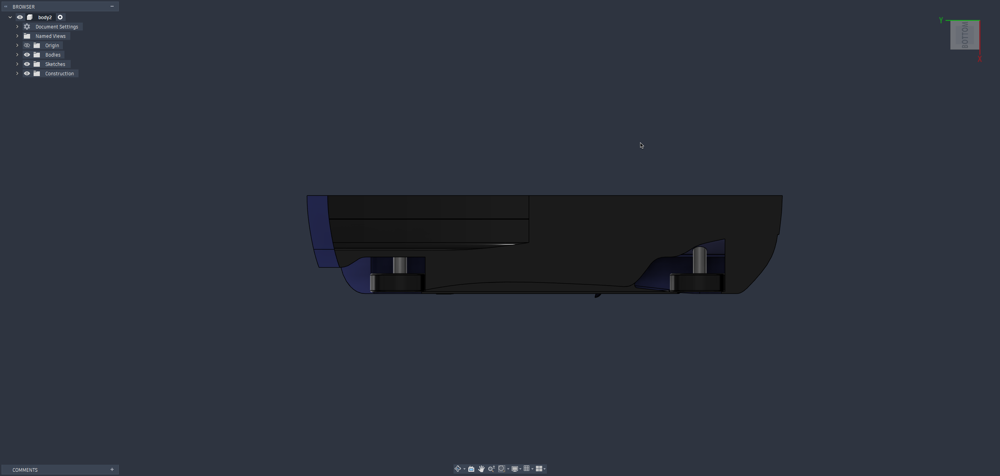

*Underbody: floor and diffuser surface, mounting bosses for suspension
hardpoints.*

## Methodology

### Flow conditions & turbulence

- Freestream 50 m/s, k-ω SST, ν = 1.5×10⁻⁵ m²/s.
- Inlet: fixed velocity (0, 50, 0). Convention: Y = streamwise, Z = vertical,
  X = lateral/symmetry.
- Ground: moving-wall velocity matching freestream.
- Wheels: `rotatingWallVelocity`, ω = 173.07 rad/s at 50 m/s, radius
  0.2889 m.
- Engine intake (`engsim.stl`): flow-rate outlet, 0.392 m³/s (3.0L
  twin-turbo V6 assumption: 7500 rpm, 1.2 bar boost, PR≈2.2, 95% VE).
  Extraction direction confirmed from the solved flux field (100% positive
  flux).

### Mesh strategy

snappyHexMesh, 12 parallel processes. Refinement: body (4,5), wheels (5,6),
mirror (6,6); front vent, side skirt, all six VGs, engine intake blocker,
diffuser fin, rear spoiler at (6,7) surface level.

Level 8 was needed at the VGs but crashed snappyHexMesh as a surface-level
refinement (segfaults in `hexRef8::setRefinement`, heap corruption in
`addLayers`). Fix: level 8 only via small volumetric refinement boxes per
VG (~0.0004–0.0009 m³ each). An early single shared box across all six VGs
(~0.027 m³) caused the cell-count explosion; splitting into six tight boxes
fixed it.

y+ check on an early field: ground avg y+ ≈ 252 (down from 1594 pre-layers),
VGs avg 33–131, max 169–337.

### Solver strategy

Steady RANS precursor (`simpleFoam`, SIMPLEC, relaxation on U/k/omega only,
no p relaxation, matching OpenFOAM's motorBike tutorial) to residual
plateau, then transient PIMPLE (`pimpleFoam`, backward scheme, 3 outer
correctors) once residual oscillation stopped decaying.

Pressure solved on GPU via **amgx4Foam** (direct AmgX integration, not the
PETSc wrapper) over a custom CUDA-aware OpenMPI, AGGREGATION AMG + PCG.
Transient run used `maxCo 30` instead of `maxCo 1`: at `maxCo 1`, sub-mm
near-wall cells Courant-limit the timestep to ≈8×10⁻⁶ s (2 s of physical
time ≈ two weeks wall-clock). `maxCo 30` cut that by ~30×.

### Convergence monitoring

Final mesh generation (snappyHexMesh) result, clean checkMesh-equivalent
(all checks 0, "Finished meshing without any errors"):

| Metric | Value |
|---|---|
| Total cells | 3,799,277 |
| Castellation refinement iterations | 9 |
| Snapping iterations | 41 |
| Layer addition iterations | 7 |

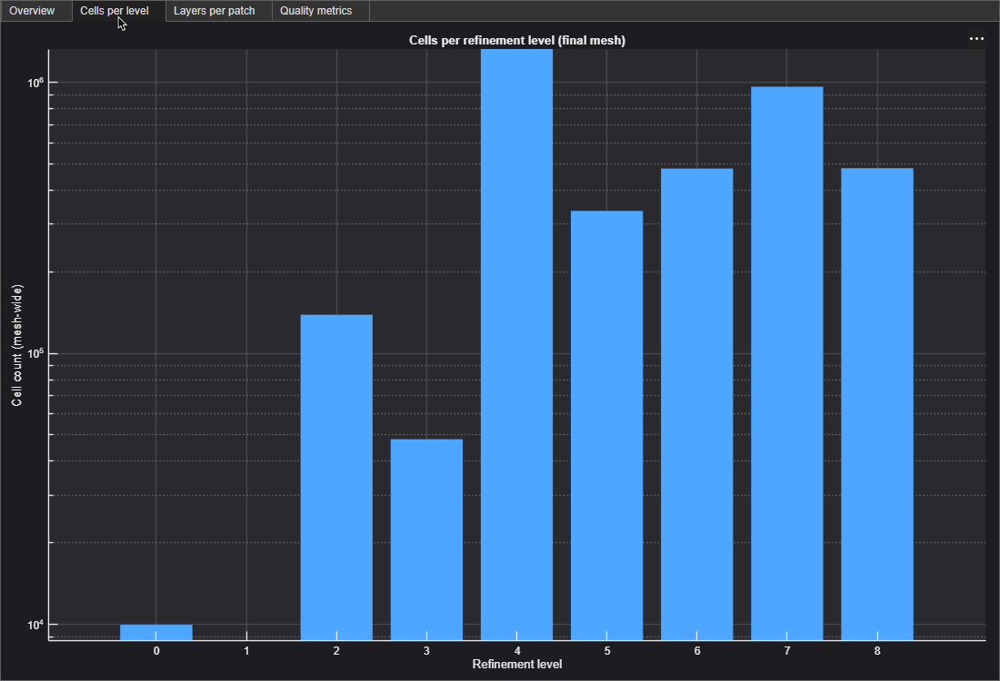

*Cells per refinement level (final mesh): level 4 dominant, level 7 second.*

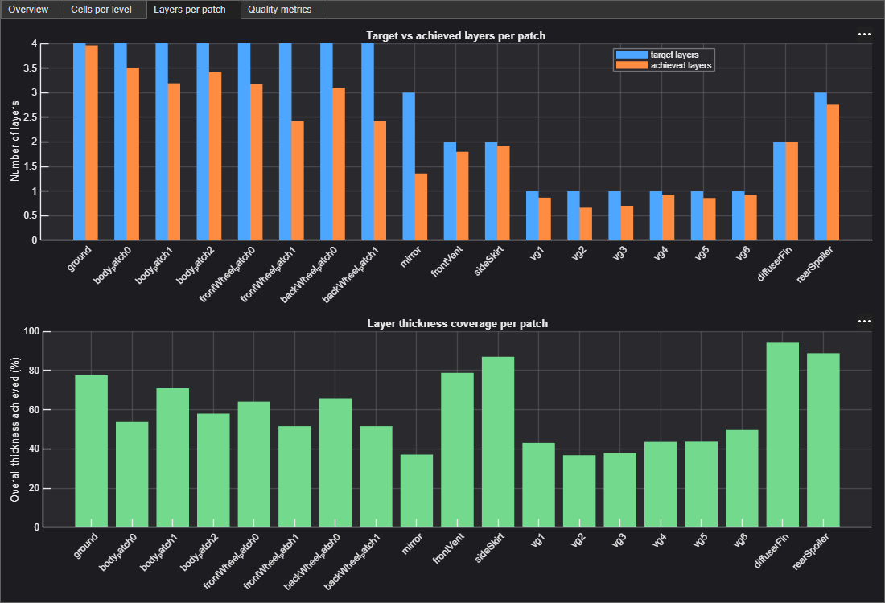

*Target vs. achieved layers and thickness coverage across every patch
(ground, body, wheels, mirror, front vent, side skirt, all six VGs,
diffuser fin, rear spoiler) — diffuserFin and rearSpoiler achieve the
highest coverage (~87–93%), the VGs and mirror the lowest (~35–48%).*

<table>
<tr><th>Time pacing</th><th>Initial residuals</th><th>Final residuals</th></tr>
<tr>
<td>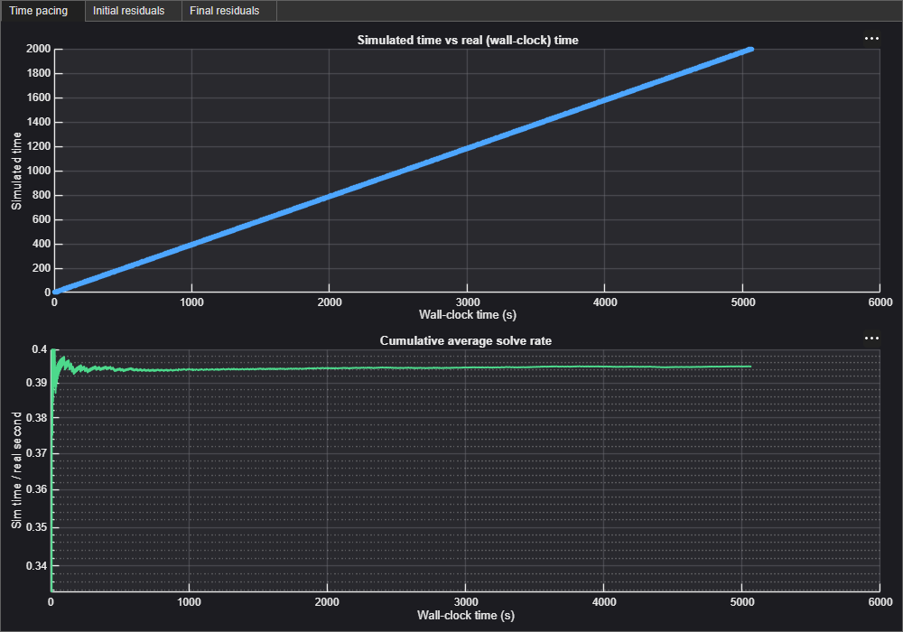</td>
<td>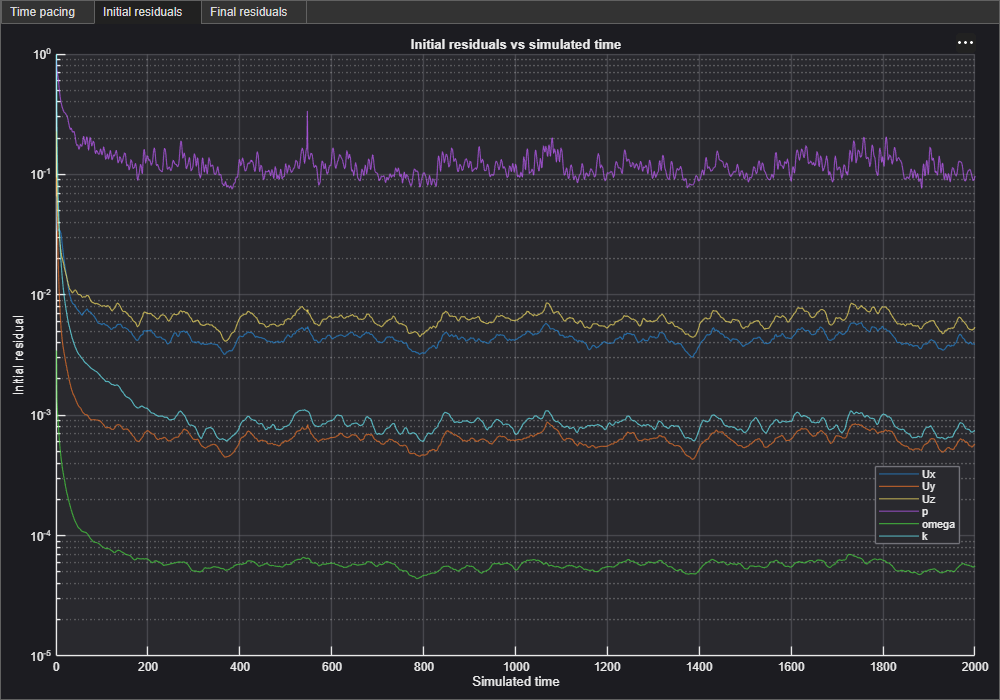</td>
<td>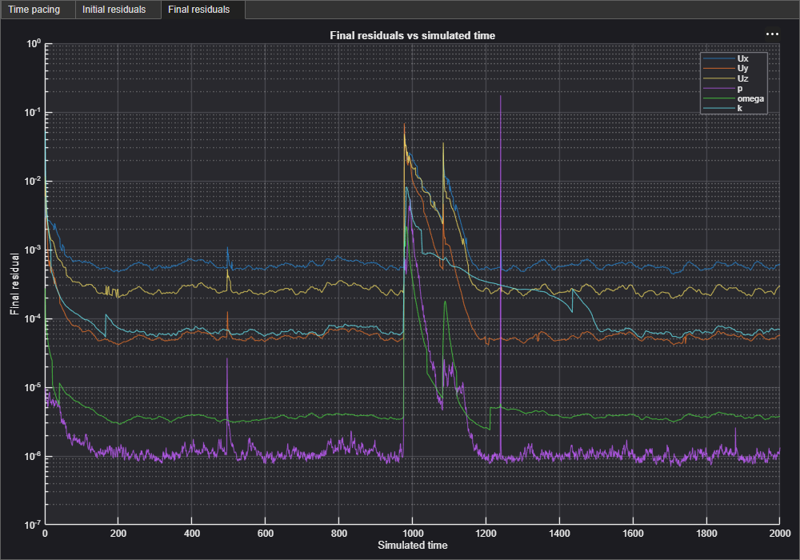</td>
</tr>
</table>

*simpleFoam solve: simulated time vs. wall-clock (~0.395 sim-s/wall-s
cumulative average), and per-field initial/final residuals over the full
t=0–2000 run.*

## GPU Acceleration (AmgX)

### Setup

Pressure solved via **amgx4Foam + foam2csr** (direct AmgX integration).
Chosen over `petsc4Foam` (an earlier approach — source still exists on disk
but is unused). Requires a custom-built CUDA-aware OpenMPI, since the stock
system OpenMPI has no CUDA support. AmgX config (`system/amgxpOptions`):
AGGREGATION AMG preconditioner + PCG solver. `p` solver: `amgx`, tolerance
1e-7, relTol 0.05, matrix caching set to update every solve.

### Problems & solutions

- **Rank-count reliability is an open, unresolved risk, not a fixed bug.**
  Isolated testing only formally validated **2 MPI ranks** as reliable — 4
  ranks hung, 8+ crashed with pinned-memory errors. That was never actually
  solved; production simply runs at **12 ranks** across many sessions
  without incident. This gap between "formally validated" and "empirically
  working" is tracked as a known risk to watch for if a new hang/crash shows
  up at high rank counts, not something to assume is fixed.
- **Ctrl+C wedges the GPU driver.** Killing a running AmgX solve with an
  abrupt SIGINT left the GPU driver in a wedged state (unkillable D-state
  processes, `nvidia-smi` hangs), requiring a full `wsl --shutdown` to
  recover — this happened multiple times before the fix below. **Fix**:
  added a `-stop` flag to `Allsolve` that sets `stopAt writeNow` via
  `runTimeModifiable` — the solver finishes its current timestep and exits
  through AmgX/CUDA's normal shutdown path instead of being killed mid-solve.

## Engineering Challenges

- **Mismatched refinement levels between adjacent patches crash the
  mesher.** Engine intake blocker (`engSim`) sits interleaved with the side
  skirt. Lowering its refinement crashed snappyHexMesh due to the level
  mismatch against its (6,7) neighbor. Fix: match neighboring patch levels.
- **Layer-addition parameters have narrow safe ranges.** `minThickness`
  0.1→0.05 let near-zero-height cells through, spiking omega's wall function
  to ~10⁵ and crashing the solver immediately. `nGrow` 0→1 collapsed layer
  coverage across most of the mesh.
- **A plausible fix that failed under testing.** Volumetric boxes were
  hypothesized to improve layer coverage, not just castellation. Tested on
  five VGs: coverage stayed at 13–19% regardless. Boxes kept for
  castellation consistency; the coverage assumption was dropped.
- **A misconfigured BC produced an implausible result.** Engine intake
  velocity at 30 m/s (3.2× too high) gave Cd 0.702, Cl -0.898. Correcting to
  0.392 m³/s and fixing the reference area restored the result below.

## Results

Reference area 0.9314 m² (9187.988 cm² half-model + 126 cm² wheel overhang):

| Coefficient | Value |
|---|---|
| Cd | 0.278 |
| Cl | -0.180 (net downforce) |

Cs ≈ -0.807 also appeared. This is expected for a half-model: true side
force on a symmetric car is zero by construction, and a single-symmetry-plane
mesh can't resolve that near-zero quantity meaningfully.

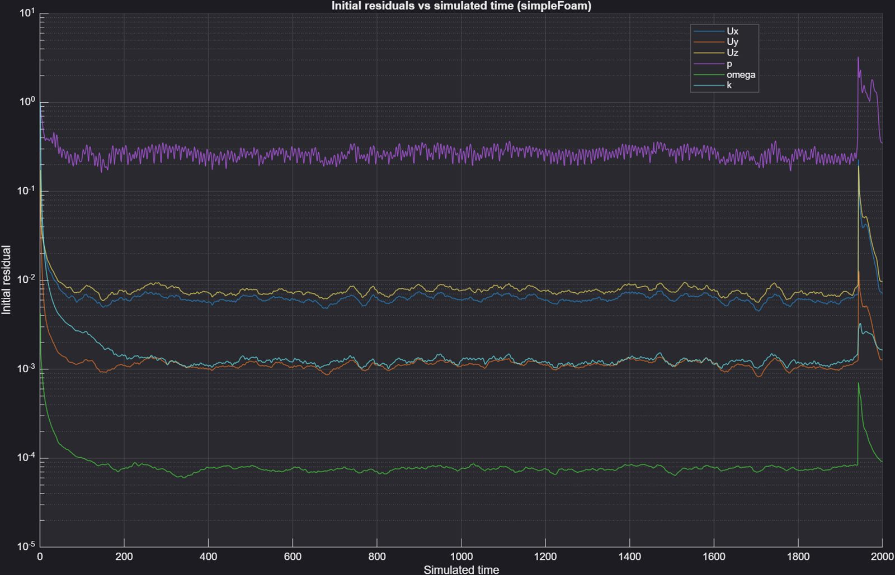

*Residuals plateau from t≈200 onward rather than fully converging, motivating
the transient PIMPLE run, with one excursion around t≈1941–1950 that
self-corrects.*

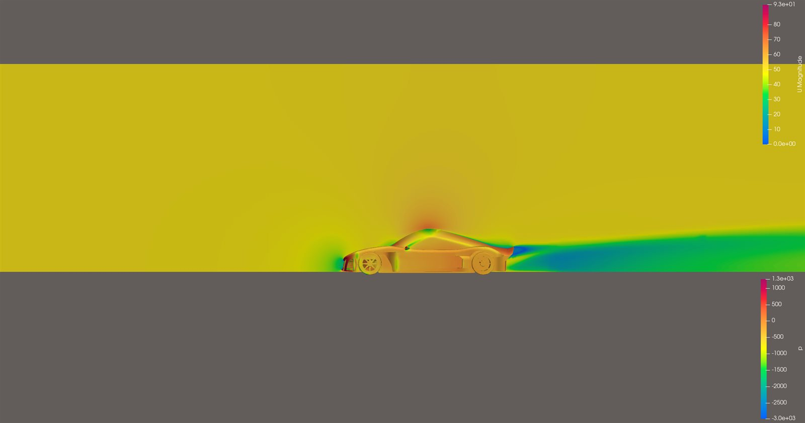

*Velocity/pressure on the symmetry plane, from an earlier mesh iteration
predating the final VG/diffuser/spoiler geometry.*

> Only 2 MPI ranks were formally validated as reliable with AmgX in isolated
> testing (4 hung, 8+ crashed with pinned-memory errors). Production ran at
> 12 ranks across many sessions. Open risk, not resolved.

[← Back to all projects](../README.md) · [Supersonic Missile](../superSonic/)
