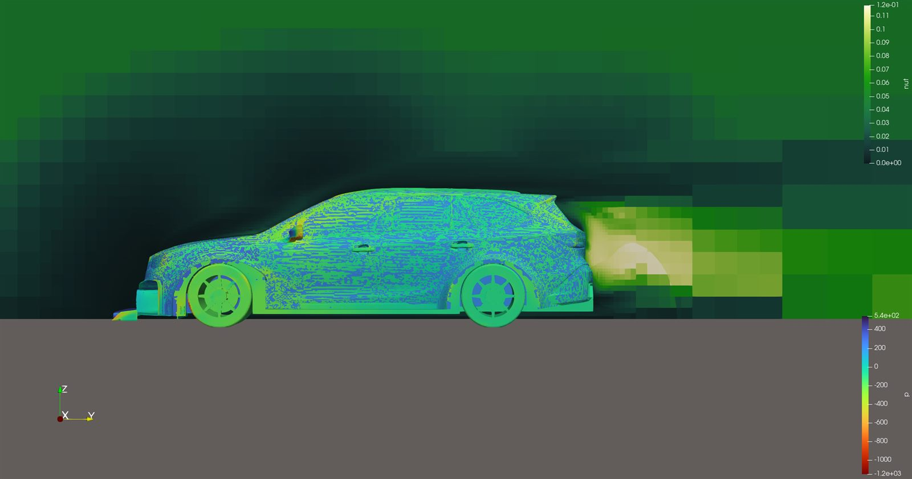
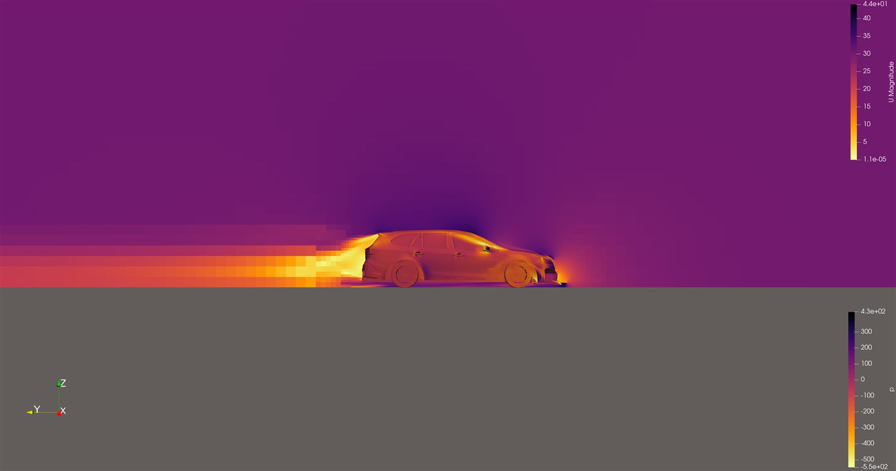

# Subaru Outback (2022) — Automotive External Aero

Custom-built vehicle model, two design/geometry iterations, measured drag
improvement between them.

> This was an earlier project; its live OpenFOAM case directory no longer
> exists. Flow conditions, mesh, and solver choice below are reconstructed
> from surviving screenshots/files, not confirmed live dictionaries — marked
> as reconstruction, not verified fact. Force coefficients come directly
> from captured terminal output, so those numbers are solid.

| Cd (rev 1) | Cd (rev 2) | Cl (rev 2) | Geometry |
|---|---|---|---|
| 0.417 | 0.352 | -0.351 | Custom CAD |

## Problem & Goal

External aero of a 2022 Subaru Outback XT, custom CAD (not a stock mesh
library model). Built in Blender, checked against a real trim-level
build-list spreadsheet for dimensional accuracy. Separate wheel, front-vent,
and engine-block geometry modeled — partial underhood cooling-flow detail,
not just an external shell.

## Methodology *(reconstructed — see caveat above)*

- Geometry: Blender base (`Subaru Outback 2022.blend`), exported to STL/OBJ,
  with separate wheels, front vent, engine block. Second revision in Fusion
  360 ("obxt" = Outback XT, "Rev1").
- Flow regime: low-speed/near-incompressible, highway-speed automotive
  (velocity contours ~40–44 m/s).
- Turbulence/solver: no surviving dictionary confirms the model; RANS
  eddy-viscosity turbulence and steady-state solver (likely `simpleFoam`)
  is the standard inference from the visualized fields.
- Mesh: not recoverable in detail. Stair-stepped contours in the wake
  suggest a snappyHexMesh-style background+refinement mesh, coarser than
  the race-car project.

## Results — Two Design Iterations

| | Rev 1 (Blender) | Rev 2 (Fusion 360) |
|---|---|---|
| Cd | 0.417 | 0.352 |
| Cl | -0.651 | -0.351 |
| Cl, front axle | -0.425 | -0.344 |
| Cl, rear axle | -0.226 | -0.007 |
| Cm | -0.099 | -0.169 |

Cd dropped 0.417→0.352, total lift magnitude roughly halved, lift shifted
almost entirely to the front axle. Production Outback-class wagons report
factory Cd around 0.32–0.34, so 0.352 is plausible; 0.417 reads as an
early/rough-geometry overestimate.

> Not confirmed whether both runs used identical reference values (velocity,
> area, length) — no `forceCoeffsDict` survives from either run. Some
> difference could reflect changed reference parameters rather than
> geometry alone.

*Turbulent viscosity (nut) and pressure on the symmetry plane: flow
separation, low-pressure wake behind the hatch.*

*Velocity/pressure along the vehicle profile: stagnation at the front
fascia, accelerated flow over the roofline.*

[← Back to all projects](../README.md) · [Race Car Aero](../racecarAero/) · [Supersonic Missile](../superSonic/)
