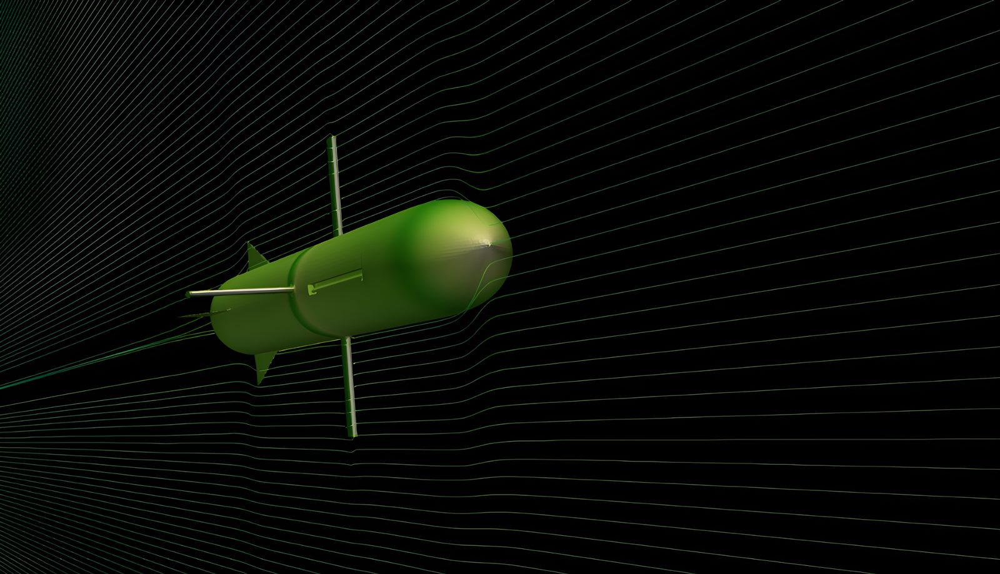

# Supersonic Missile Aerodynamics — Mach 3.8115

Two-stage boosted missile (nose, fuselage, body fins, booster fins) at a
flight condition from a point-mass ascent trajectory model, using a
two-mesh coarse-to-fine workflow for a 1.2M-cell compressible solve.

| Mach | Altitude | Cd | Fine mesh | Solver |
|---|---|---|---|---|
| 3.8115 | 15.77 km | 0.0310 | 1.23M cells | sonicFoam |

## Problem & Goal

Compressible aero of a two-stage missile at a supersonic condition:
converged drag coefficient, and confirmation that shock structure and
near-zero lift/side-force/moments (axisymmetric body, zero AoA) are
physical. Stage 1: solid rocket motor sustainer (powered boost). Stage 2:
unpropelled glide stage with variable-sweep wings, sweep angle set by
flight state. Flight condition taken from a point-mass ascent trajectory
model (velocity, Mach, altitude, thrust, drag, stage, propellant mass,
stability margin) at ~19 s into flight, mid first-stage burn.

## missileFlightApp (MATLAB)

Custom MATLAB app used to size the flight condition simulated in this case.
Point-mass trajectory model covering the full flight profile: loft
trajectory, engine/sustainer burn, staging, and the unpropelled glide phase.
Computes:

- Maximum range for a given impact speed
- Loft trajectory (altitude/velocity/Mach vs. time)
- Staging events (sustainer burnout, second-stage separation)
- Variable-sweep wing angle vs. flight state on the glide stage
- Fin deflection angle

The Mach 3.8115 / 15.77 km CFD condition above is a single point pulled from
this model's output, not an arbitrary test case.

### App layout

Five tabs: Flight Path (trajectory, velocity/ground track, forces &
atmospheric density), Aircraft Characteristics (CG migration, wing sweep,
fin trim deflection), Engine (motor design + thrust/propellant-burn plots),
Geometry (2D top-view animation), Data Table (full per-timestep output,
right-click export to CSV).

*Flight Path tab: trajectory, Mach/ground-track history, and force/density
history for the default launch parameters.*

*Aircraft Characteristics tab: CG migration, wing sweep angle vs. flight
path angle, and fin trim deflection over the same flight.*

### Integration and CFD feedback loop

Trajectory integration is RK4, replacing an earlier explicit-Euler scheme —
Euler's numerical damping was under-predicting peak Mach (3.81 vs. RK4's
4.3) and range during the high-thrust boost phase. `readLatestForceCoeffs.m`
scans the OpenFOAM case's `postProcessing/forceCoeffs/` for the most
recently written result and computes a calibration factor
(`Cd_CFD / Cd_analytical`) applied to stage-1 drag. Since the CFD geometry
covers the whole boosted stack (nose/fuselage/body fins/booster fins) with
no separate glide-fin surface, the factor is applied only to those terms —
an earlier version incorrectly scaled tail-fin drag with a factor never
validated against it. Cl/CmPitch calibration is also read from CFD but
skipped when the analytical baseline is ~0 (AoA=0 on a symmetric body),
since the ratio is undefined there.

### Motor model

Solid rocket motor sized from a fixed CAD envelope (88mm OD × 1m length):
wall thickness and material (Aluminum/Steel/Titanium/CarbonFiber/Fiberglass)
set casing mass and remaining bore volume; propellant mass falls out of
that bore volume × propellant density. Propellant type (APCP, double-base,
black powder, HTPB/AP/Al) and nozzle expansion ratio drive an effective Isp
via a nozzle-efficiency curve. This is a parametric approximation, not a
real internal-ballistics model — no grain burn-area geometry, no
chamber-pressure/burn-rate coupling.

### Geometry rendering and debugging

Nose, fuselage, and booster fins render from real STL outlines (sliced at
the Y=0 plane, top-view, so a laterally-swept wing is actually visible
rather than edge-on). The wing itself is a synthetic constant-chord
rectangle driven by the same sweep formulas as the aero model — real-STL
wing rotation was tried and reverted after it produced degenerate,
flying-off shapes at large sweep angles, traced to rotating about a pivot
that didn't match the STL's actual coordinate frame.

Two behaviors that looked like bugs but weren't: the top-stage CG appeared
to toggle between two fixed points instead of moving continuously with wing
sweep, which turned out to be a real, continuous ~5mm shift on a ~965mm
body — correct physics, just below the plot's visible resolution. Booster
separation went through several corrections based on the real staging
behavior (booster body and its fins jettison together as one unit at
stage separation, not fins alone) before the drawing and the mass/CG
physics in `simulateFlight.m` agreed.

*Geometry tab, stage 1: full boosted stack, wing stowed (90° sweep) inside
the fuselage, booster fins attached, engine plume rendered from
instantaneous thrust.*

*Geometry tab, stage 2: booster (with its fins) jettisoned, wing swept out
to 22.8°, tail fin trimmed to -3.9° at Mach 0.98.*

## Methodology

### Flow conditions

- Mach 3.8115, 1124.9 m/s, 15.77 km altitude (ISA stratosphere).
- p∞ = 10,663 Pa, T∞ = 216.65 K, ρ∞ = 0.1714 kg/m³ (ideal gas law, within
  rounding).
- Inlet: `supersonicFreestream`. Outlet/sides: `inletOutlet` (U/T),
  `waveTransmissive` (p) — non-reflecting outflow.
- Thermophysical: `hePsiThermo` / `perfectGas`, air (Cp 1005, μ 1.8×10⁻⁵,
  Pr 0.7).
- Turbulence: RAS Launder-Sharma k-ε (low-Re, wall-resolved).

### Two-mesh strategy

Coarse mesh run first, mapped onto the fine mesh, avoiding a cold-start
shock-formation transient on the expensive mesh:

| | Coarse mesh | Fine mesh |
|---|---|---|
| Cells | 175,166 | 1,232,688 |
| Faces | 558,029 | 3,856,056 |
| Fin refinement level | 6 | 8 |
| Timestep | 4×10⁻⁷ s | 9×10⁻⁸ s |
| End time | 0.03 s | 0.005 s |

A `coarsemap` script reconstructs the coarse case's latest timestep and runs
`mapFields -consistent` onto the fine mesh. 611,508 of 1,232,688 fine-mesh
cells sit at the finest level, concentrated at the fins. Boundary layers
reached 55–86% of target thickness by patch; mesh passed all quality checks,
zero illegal faces.

### Solver strategy

`sonicFoam`, Euler time stepping, bounded/TVD schemes for shocks/expansion
fans. Decomposition: `scotch` (minimizes inter-processor boundaries on
complex geometry), 12 cores, single workstation. Fixed 9×10⁻⁸ s timestep
kept mean Courant ≈0.00028 (max 0.364).

## Engineering Challenges

- **A GPU linear-solver stack was built, then not shipped.** Built from
  source: CUDA-aware OpenMPI, PETSc (standard + CUDA-MPI), `petsc4Foam`,
  `foam2csr`, `amgx4Foam`, plus patches for known AmgX integration bugs.
  Production runs use OpenFOAM's native CPU `DILUPBiCGStab` — no `libs`
  entry for AmgX in the shipped `controlDict`. GPU path hit integration
  friction against this OpenFOAM version's API; CPU path shipped instead.
  (Same GPU-solver infrastructure is integrated on the race car project —
  see that case study.)
- **Solver choice pivoted mid-project.** Early setup used `rhoPimpleFoam`
  (transient PIMPLE, adjustable local timestepping). Final case moved to
  `sonicFoam`, fixed small timestep, explicit PISO — simpler and more
  robust for genuinely supersonic flow.
- **Mesh-quality issues tracked to specific cells.** An earlier pass had 9
  illegal faces at identifiable cell IDs; final pass: 0 illegal faces.

## Results

At t = 0.00492102 s, ρ∞ = 0.1714, l_ref = 1.974 m, A_ref = 0.0791 m²
(body diameter ≈ 0.317 m):

| Coefficient | Value |
|---|---|
| Cd (total) | 0.0310 |
| Cd, forward half | 0.0155 |
| Cd, rear half | 0.0155 |
| Cl, Cs, Cm (pitch/roll/yaw) | ≈ 0 (as expected) |

Drag splits evenly forward/rear; lift/side-force/moment ≈ 0, as expected for
an axisymmetric body at zero AoA. Cd holds at 0.0309–0.0310 (±0.0002) over
the final ~0.0008 s.

*Density/pressure-gradient visualization at Mach 3.8: bow shock off the nose
and body, turbulent wake from the tail fins.*

*Streamlines around the nose, body, and fin geometry.*

> Flight condition (Mach/altitude) was read directly from a time-resolved
> ascent trajectory model, not picked as a round test number — the result
> reflects a specific point in a modeled flight profile.

[← Back to all projects](../README.md) · [Race Car Aero](../racecarAero/)
