# Supersonic Missile Aerodynamics — Mach 3.8115

Two-stage boosted missile (nose, fuselage, body fins, booster fins) at a
flight condition from a point-mass ascent trajectory model, using a
two-mesh coarse-to-fine workflow for a 1.2M-cell compressible solve.

| Mach | Altitude | Cd | Fine mesh | Solver |
|---|---|---|---|---|
| 3.8115 | 15.77 km | 0.0310 | 1.23M cells | sonicFoam |

## Goal

Converged drag coefficient at a real flight condition, with physical sanity
checks: correct shock structure, near-zero lift/side-force/moments (expected
for an axisymmetric body at zero AoA). A converged-looking Cd without those
checks passing isn't trustworthy.

Two-stage vehicle. Stage 1: solid rocket motor sustainer, powered boost.
Stage 2: unpropelled glide stage, variable-sweep wings, sweep angle set by
flight state. Flight condition (Mach 3.8115, 15.77 km) is a single point
from a custom flight-mechanics model, ~19 s into flight, mid first-stage
burn — not a round test number.

## Process

Four stages: define the vehicle (CAD), determine the flight condition worth
simulating (MATLAB flight-mechanics model), set up and solve the CFD case,
verify convergence. Includes the real dead ends hit along the way.

### Airframe & Avionics

Vehicle geometry and avionics, so "Mach 3.8115" refers to an actual defined
object.

Body diameter 98 mm, total (glider-stage) mass 9180.43 g. Wing pivot at
-494.5 mm from nose tip, control fins centered at -930.5 mm from nose tip.

| Component | Airfoil | Chord | Span |
|---|---|---|---|
| Main wings (deployable) | NASA SC(2)-0710 | 85 mm | 300 mm |
| Control fins | NACA 0008 | 50 mm | 100 mm |

Wing deployment: fully retracted → deployed, max actuator rate 15°/s,
starting from a Mach 2 deployment condition.

**Nose cone**: Von Kármán ogive (Haack series, C = 0 — the minimum-drag
profile for a given length/base diameter under supersonic slender-body
theory). Base radius 49 mm, fineness ratio L/D = 5 (L = 490 mm, adjustable
parameter). Profile: θ = acos(1 − 2x/L), y = (R/√π)·√(θ − sin(2θ)/2 + C·sin³θ).

CAD assembly (Fusion 360): nose, electronics bay, variable-sweep wing
assembly, booster.

*Full stack, side view: nose, electronics bay (yellow band + antenna
fairings), wings, booster body and tail fins.*

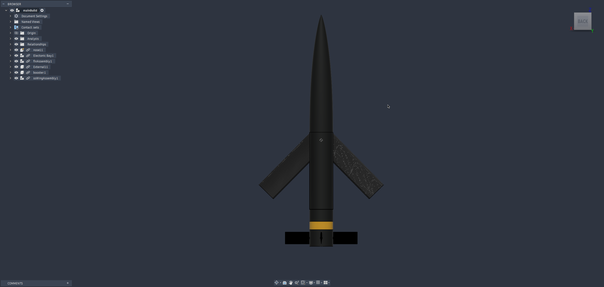

*Second stage (glider) alone: nose, electronics bay, deployed wings, tail
control-fin assembly — no booster or booster fins.*

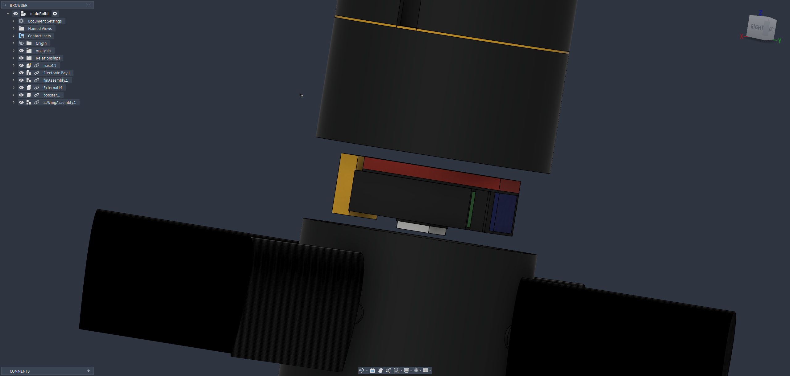

*Electronics bay, exploded view. Sensor suite and how each fits (or
doesn't) this flight regime — Mach 3.8, up to ~31 km altitude:*

- **LoRaWAN GPS tracker** — long-range, low-power telemetry, built for
  infrequent position reports on slow, recoverable ground assets. Poor fit
  here: needs a ground gateway in range, reports seconds apart (the vehicle
  covers kilometers between fixes at 1125 m/s), and its low-gain
  omnidirectional antenna isn't built for a supersonic exterior.
- **MS5611-01BA03** barometric pressure sensor — cheap, accurate altimetry
  for slow vehicles like drones. Poor fit here: rated -40 to +85°C, far
  below the ~970 K skin heating shown in the Results renders below, and its
  response bandwidth isn't sized for shock-driven pressure transients.
- **Bosch BMI085 IMU (QFN)** — 6-DOF accelerometer/gyro, ±24g / ±2000°/s
  range. Adequate for glide-phase attitude; risky during boost, where
  solid-motor ignition transients can plausibly exceed its accelerometer
  range and clip the data exactly when it matters most.
- **u-blox NEO-M9N-00B GNSS module (SMT)** — accurate multi-constellation
  position/velocity. The real problem: commercial GNSS receivers disable
  themselves above COCOM limits (1,000 kt / 514 m/s and 18 km altitude),
  specifically to prevent missile-guidance use. This vehicle exceeds both,
  so the receiver would likely lose lock during exactly the boost/glide
  phases simulated here.

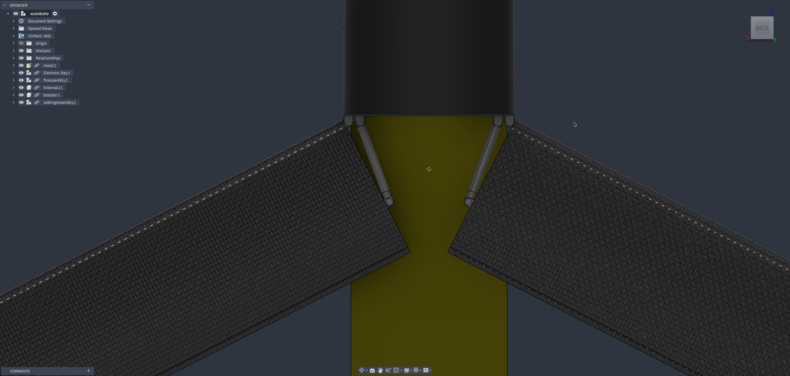

*Wing-sweep actuator mechanism at the wing root — two linear actuators per
side driving the sweep motion `missileFlightApp` models as `sweep_deg`.*

### Flight Profile — missileFlightApp

Custom MATLAB point-mass trajectory model (loft trajectory, engine/sustainer
burn, staging, unpropelled glide) computing:

- Maximum range for a given impact speed
- Loft trajectory (altitude/velocity/Mach vs. time)
- Staging events (sustainer burnout, second-stage separation)
- Variable-sweep wing angle vs. flight state on the glide stage
- Fin deflection angle

The Mach 3.8115 / 15.77 km CFD condition is a single point pulled directly
from this model's output.

#### App layout

Five tabs: Flight Path (trajectory, velocity/ground track, forces &
atmospheric density), Aircraft Characteristics (CG migration, wing sweep,
fin trim deflection), Engine (motor design + thrust/propellant-burn plots),
Geometry (2D top-view animation), Data Table (full per-timestep output,
right-click export to CSV).

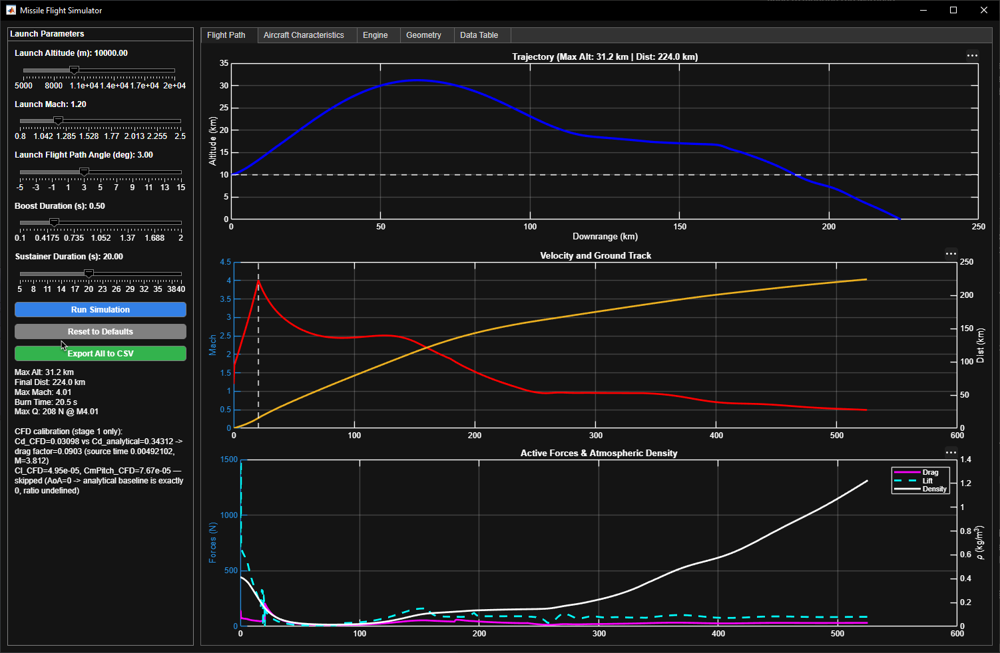

*Flight Path tab: trajectory, Mach/ground-track history, force/density
history for the default launch parameters.*

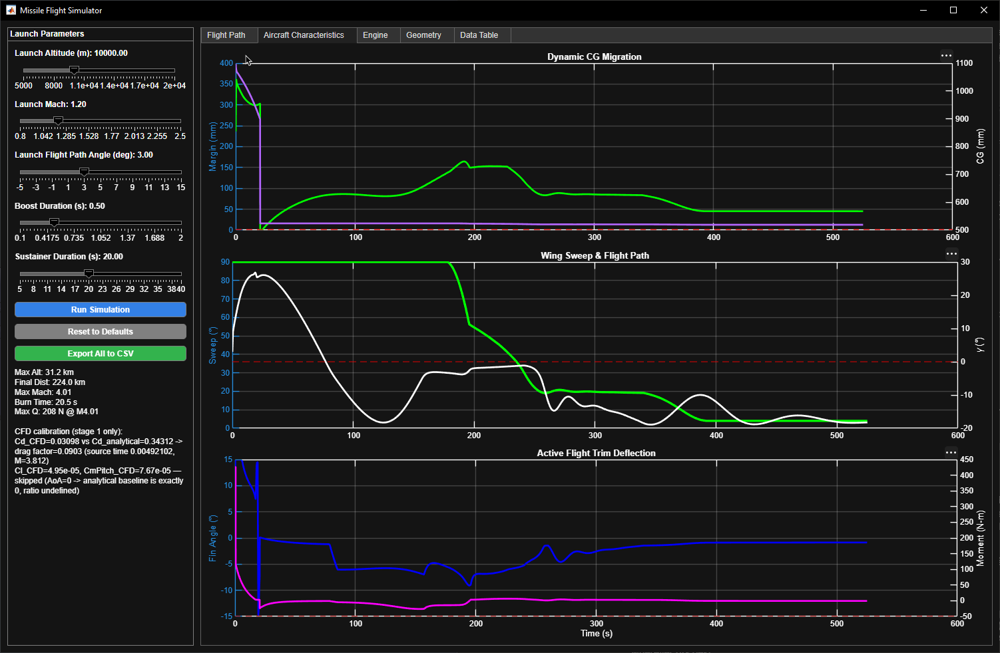

*Aircraft Characteristics tab: CG migration, wing sweep angle vs. flight
path angle, fin trim deflection over the same flight.*

#### Integration and CFD feedback loop

RK4 integration, replacing an earlier explicit-Euler scheme — Euler's
numerical damping under-predicted peak Mach (3.81 vs. RK4's 4.3) and range
during boost. `readLatestForceCoeffs.m` scans
`postProcessing/forceCoeffs/` for the latest result and computes a
calibration factor (`Cd_CFD / Cd_analytical`) applied to stage-1 drag. Since
the CFD geometry covers the whole boosted stack with no separate glide-fin
surface, the factor applies only to those terms — an earlier version
incorrectly scaled tail-fin drag with a factor never validated against it.
Cl/CmPitch calibration is also read from CFD but skipped when the
analytical baseline is ~0 (AoA=0, symmetric body), since the ratio is
undefined there.

#### Motor model

Solid rocket motor sized from a fixed CAD envelope (88mm OD × 1m length):
wall thickness and material (Aluminum/Steel/Titanium/CarbonFiber/Fiberglass)
set casing mass and remaining bore volume; propellant mass falls out of
that bore volume × propellant density. Propellant type (APCP, double-base,
black powder, HTPB/AP/Al) and nozzle expansion ratio drive an effective Isp
via a nozzle-efficiency curve. Parametric approximation, not a real
internal-ballistics model — no grain burn-area geometry, no
chamber-pressure/burn-rate coupling.

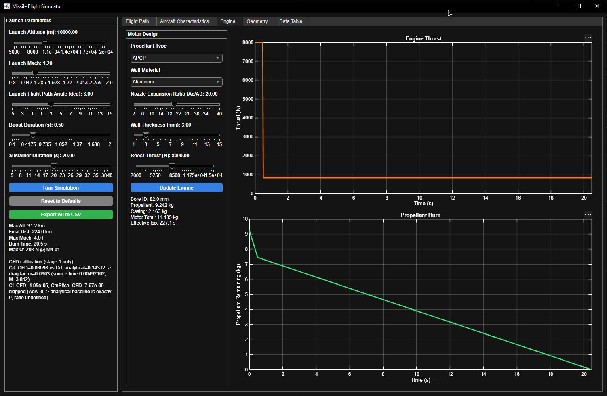

*Engine tab: motor geometry/propellant inputs (bore ID 82.0mm, 9.242kg
propellant, 2.163kg casing, 227.1s effective Isp), thrust profile (8000N
boost dropping to a lower sustain level), propellant mass depletion over
the 20.5s burn.*

#### Geometry rendering and debugging

Nose, fuselage, and booster fins render from real STL outlines (sliced at
the Y=0 plane, top-view, so a laterally-swept wing is visible rather than
edge-on). The wing is a synthetic constant-chord rectangle driven by the
same sweep formulas as the aero model — real-STL wing rotation was tried
and reverted after it produced degenerate, flying-off shapes at large
sweep angles, traced to rotating about a pivot that didn't match the STL's
actual coordinate frame.

Two behaviors that looked like bugs but weren't: the top-stage CG appeared
to toggle between two fixed points instead of moving continuously with wing
sweep — a real, continuous ~5mm shift on a ~965mm body, correct physics,
just below the plot's visible resolution. Booster separation went through
several corrections based on the real staging behavior (booster body and
its fins jettison together as one unit, not fins alone) before the drawing
and the mass/CG physics in `simulateFlight.m` agreed.

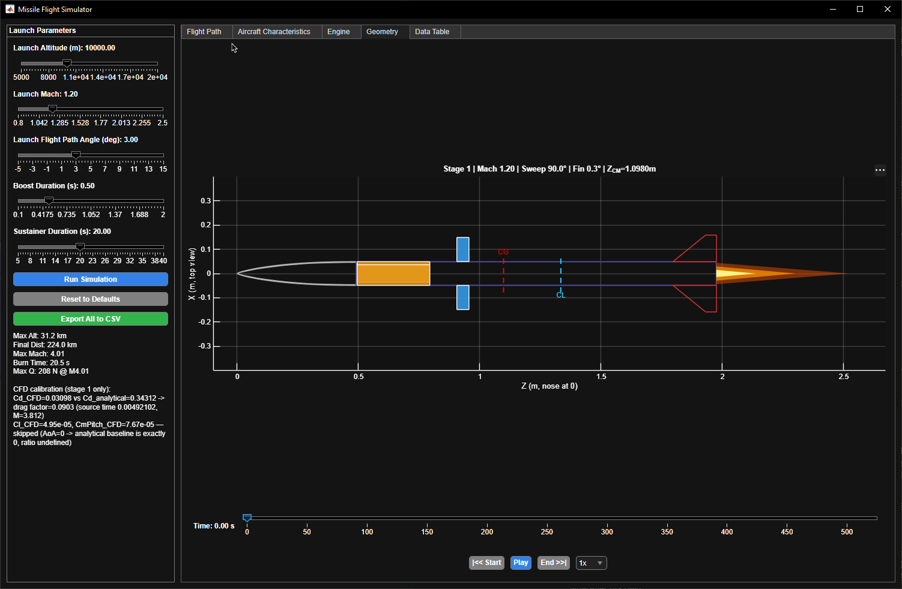

*Geometry tab, stage 1: full boosted stack, wing stowed (90° sweep) inside
the fuselage, booster fins attached, engine plume from instantaneous
thrust.*

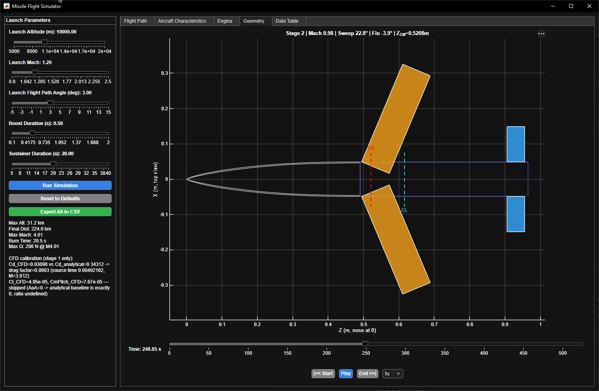

*Geometry tab, stage 2: booster (with its fins) jettisoned, wing swept out
to 22.8°, tail fin trimmed to -3.9° at Mach 0.98.*

### CFD Setup

Flow physics and a two-mesh strategy sized to resolve a Mach 3.8 shock
without being either wrong (too coarse) or prohibitively expensive (fine
everywhere).

**Flow conditions:**

- Mach 3.8115, 1124.9 m/s, 15.77 km altitude (ISA stratosphere).
- p∞ = 10,663 Pa, T∞ = 216.65 K, ρ∞ = 0.1714 kg/m³ (ideal gas law, within
  rounding).
- Inlet: `supersonicFreestream`. Outlet/sides: `inletOutlet` (U/T),
  `waveTransmissive` (p) — non-reflecting outflow.
- Thermophysical: `hePsiThermo` / `perfectGas`, air (Cp 1005, μ 1.8×10⁻⁵,
  Pr 0.7).
- Turbulence: RAS Launder-Sharma k-ε (low-Re, wall-resolved).

**Two-mesh strategy:** coarse mesh run first, mapped onto the fine mesh, to
avoid a cold-start shock-formation transient on the expensive mesh:

| | Coarse mesh | Fine mesh |
|---|---|---|
| Cells | 175,166 | 1,232,688 |
| Faces | 558,029 | 3,856,056 |
| Fin refinement level | 6 | 8 |
| Timestep | 4×10⁻⁷ s | 9×10⁻⁸ s |
| End time | 0.03 s | 0.005 s |

A `coarsemap` script reconstructs the coarse case's latest timestep and runs
`mapFields -consistent` onto the fine mesh. 611,508 of 1,232,688 fine-mesh
cells sit at the finest level, concentrated at the fins. Boundary layers
reached 55–86% of target thickness by patch; mesh passed all quality
checks, zero illegal faces.

Mesh generation (snappyHexMesh) iterations and final checkMesh-equivalent
result, both meshes clean (all checks 0, "Finished meshing without any
errors"):

| | Coarse mesh | Fine mesh |
|---|---|---|
| Castellation refinement iterations | 7 | 12 |
| Snapping iterations | 41 | 41 |
| Layer addition iterations | 27 | 11 |

### Solver Strategy

`sonicFoam`, Euler time stepping, bounded/TVD schemes for shocks/expansion
fans. Decomposition: `scotch` (minimizes inter-processor boundaries on
complex geometry), 12 cores, single workstation. Fixed 9×10⁻⁸ s timestep
kept mean Courant ≈0.00028 (max 0.364).

### Convergence Verification

Evidence the mesh resolved the geometry and the solve actually settled,
coarse vs. fine.

#### Cells per refinement level

<table>
<tr><th>Coarse mesh</th><th>Fine mesh</th></tr>
<tr>
<td>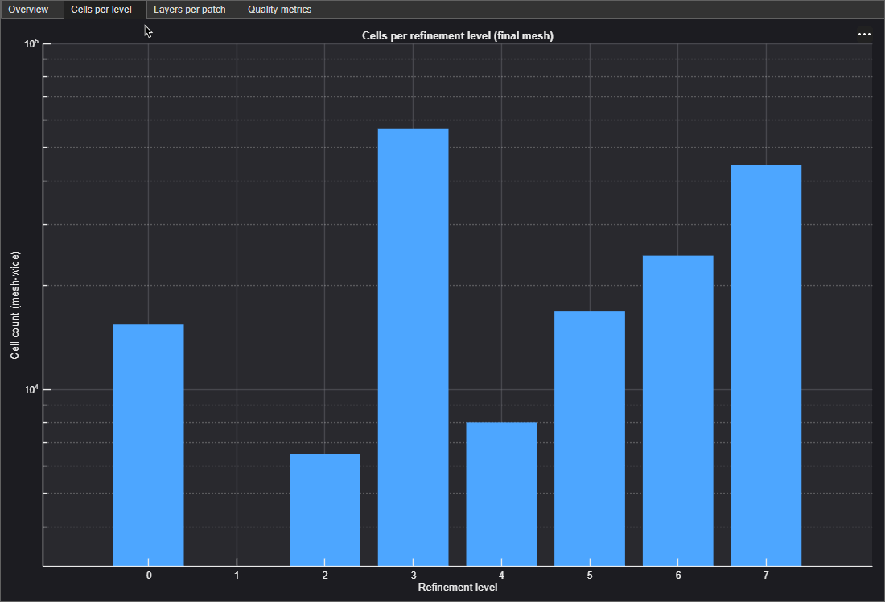</td>
<td>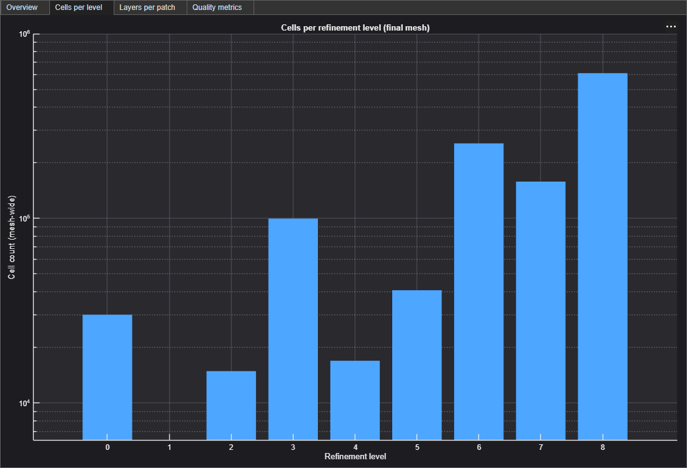</td>
</tr>
</table>

*Coarse mesh tops out at refinement level 7; fine mesh reaches level 8,
which dominates at 611,508 of 1,232,688 total cells (~50%).*

| Metric | Coarse mesh | Fine mesh |
|---|---|---|
| Total cells | 175,166 | 1,232,688 |
| Max refinement level | 7 | 8 |
| Cells at max level | ~75,000 (~43%) | 611,508 (~50%) |

#### Layers per patch

<table>
<tr><th>Coarse mesh</th><th>Fine mesh</th></tr>
<tr>
<td>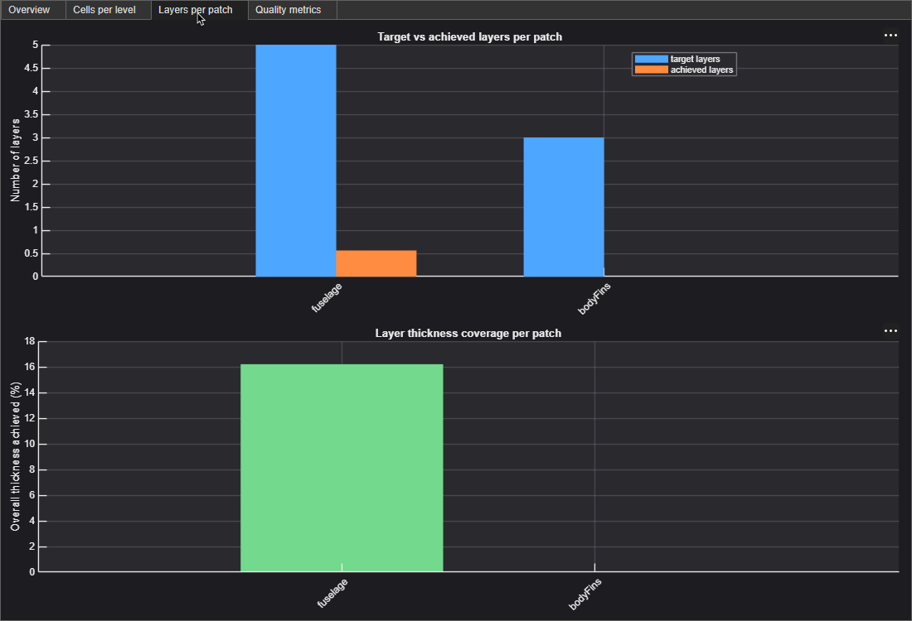</td>
<td>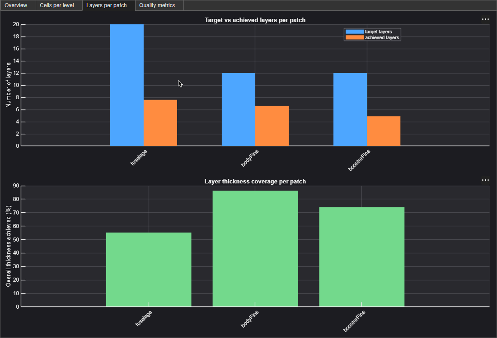</td>
</tr>
</table>

*Coarse mesh only resolved layers on fuselage/bodyFins with low coverage
(~16% fuselage, ~0% bodyFins); fine mesh reaches full three-patch coverage
at 54–85%.*

| Patch | Coarse target layers | Coarse coverage | Fine target layers | Fine coverage |
|---|---|---|---|---|
| fuselage | 5 | ~16% | 20 | 54% |
| bodyFins | 3 | ~0% | 12 | 85% |
| boosterFins | — (not tracked) | — | 12 | 73% |

#### Solver results

Full-range solve logs:

<table>
<tr><th>Coarse mesh</th><th>Fine mesh</th></tr>
<tr>
<td>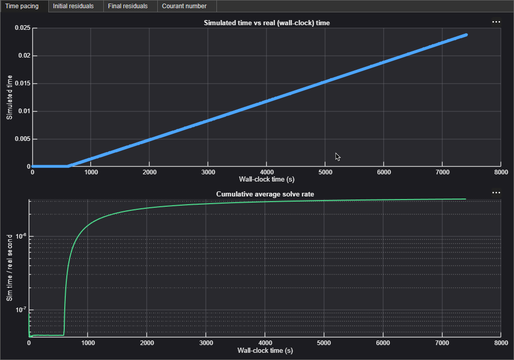</td>
<td>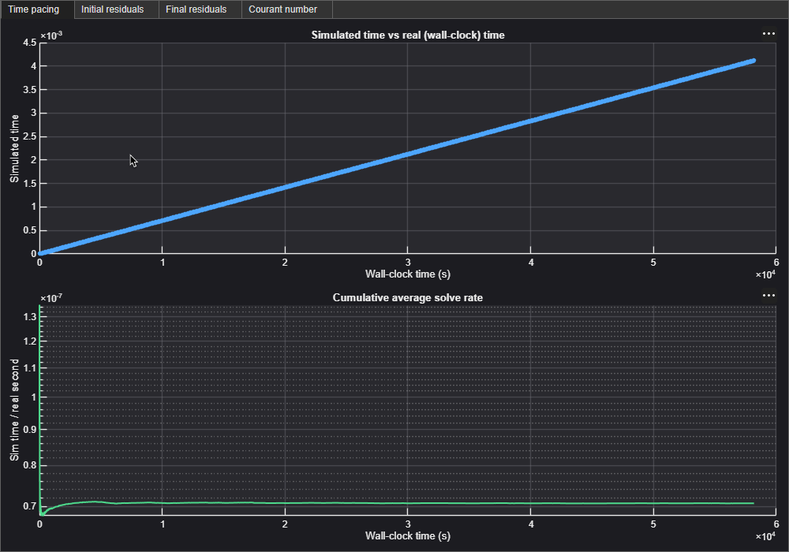</td>
</tr>
</table>

*Time pacing: simulated time vs. wall-clock time, cumulative average solve
rate.*

<table>
<tr><th>Coarse mesh</th><th>Fine mesh</th></tr>
<tr>
<td>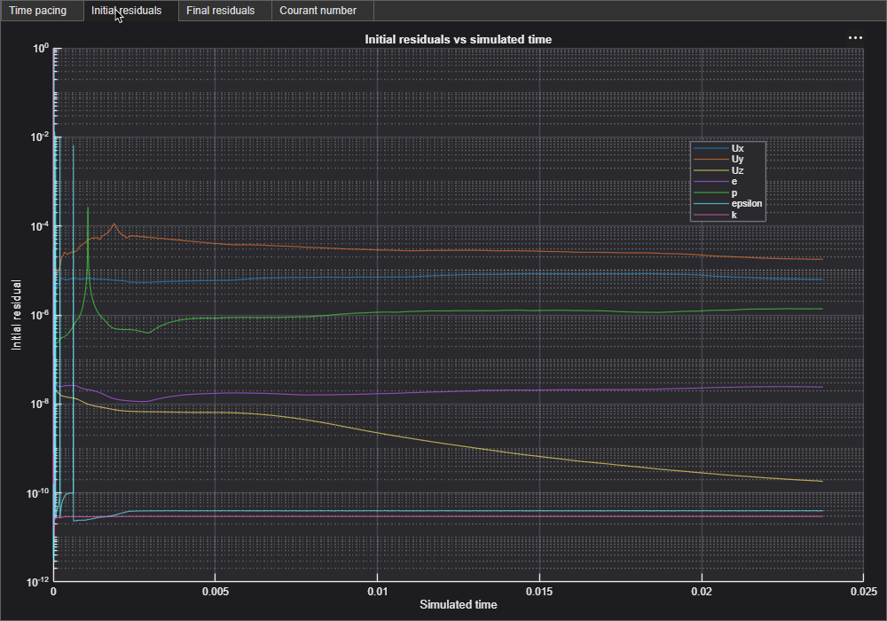</td>
<td>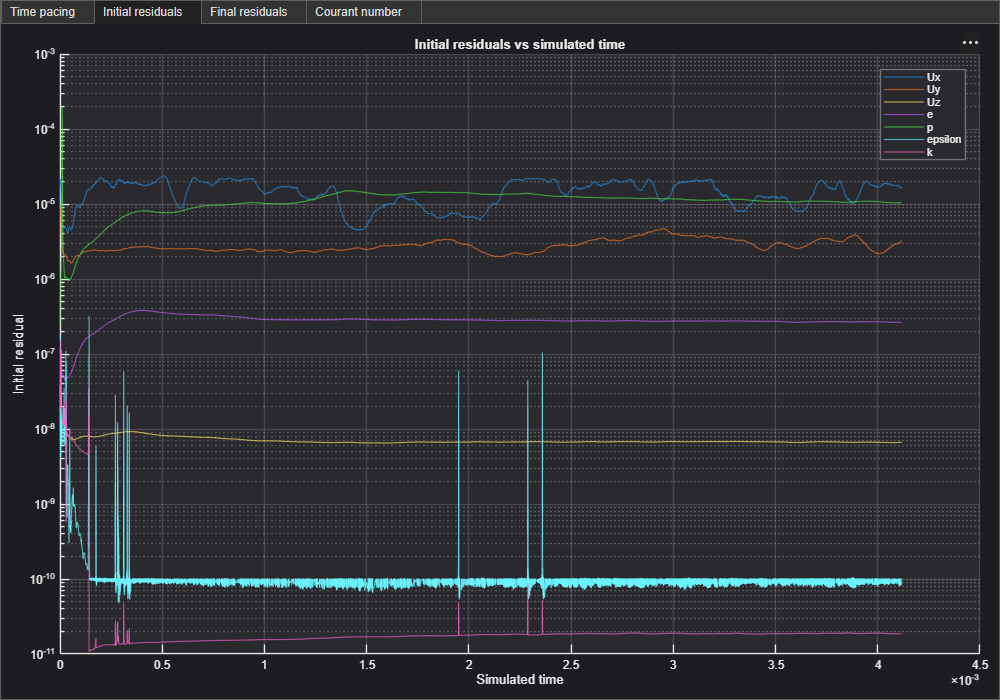</td>
</tr>
</table>

*Initial residuals per field.*

<table>
<tr><th>Coarse mesh</th><th>Fine mesh</th></tr>
<tr>
<td>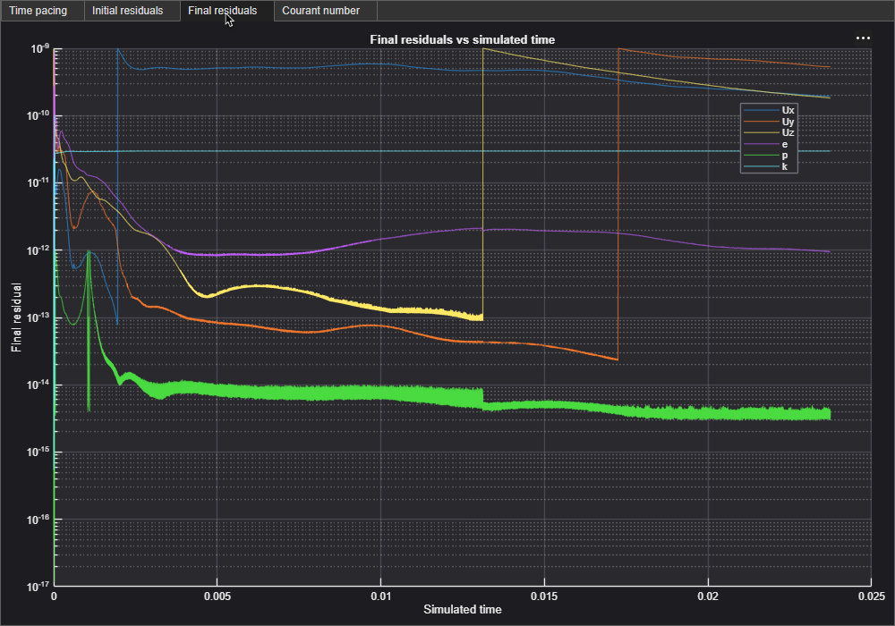</td>
<td>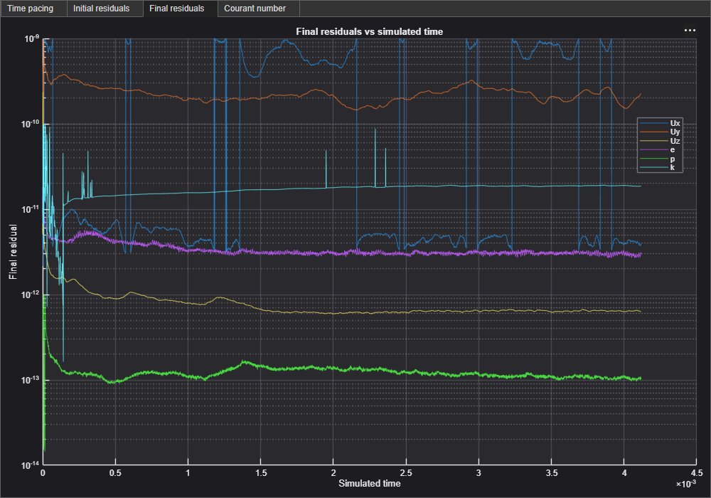</td>
</tr>
</table>

*Final (post-inner-iteration) residuals per field.*

<table>
<tr><th>Coarse mesh</th><th>Fine mesh</th></tr>
<tr>
<td>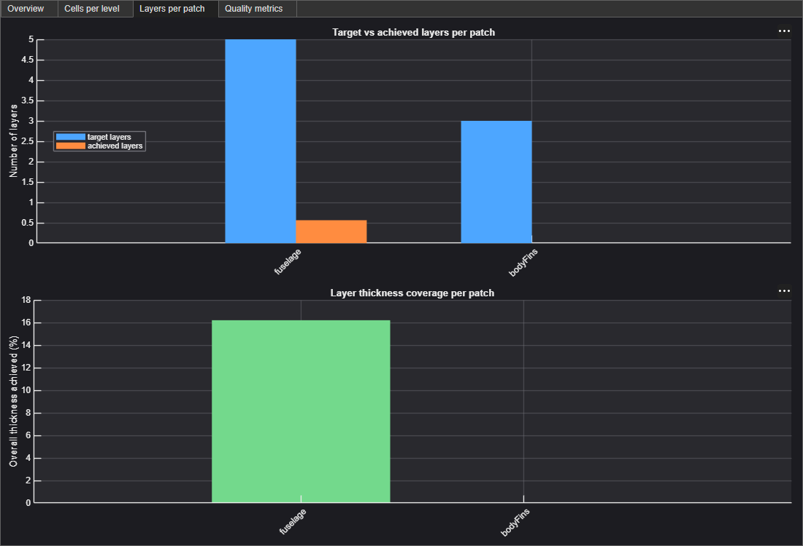</td>
<td>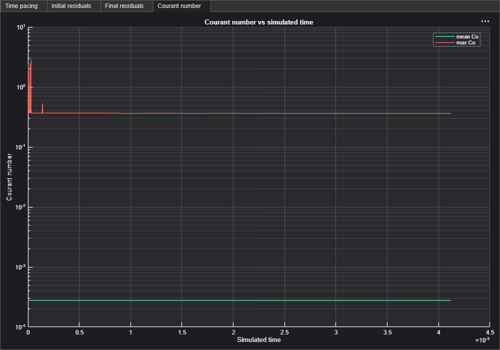</td>
</tr>
</table>

*Mean/max Courant number.*

| Metric | Coarse mesh | Fine mesh |
|---|---|---|
| Simulated time reached | ~0.024 s (of 0.03 s target) | ~0.0041 s (of 0.005 s target) |
| Wall-clock time | ~7,400 s (~2 h) | ~58,000 s (~16 h) |
| Mean Courant | ~1×10⁻³ | ≈0.00028 |
| Max Courant | ~0.35 | ≈0.364 |

Coarse mesh also solved across two separate sessions on the same case
(run1/run2), compared directly:

<table>
<tr><th>Coarse mesh — initial residuals</th><th>Coarse mesh — final residuals</th></tr>
<tr>
<td>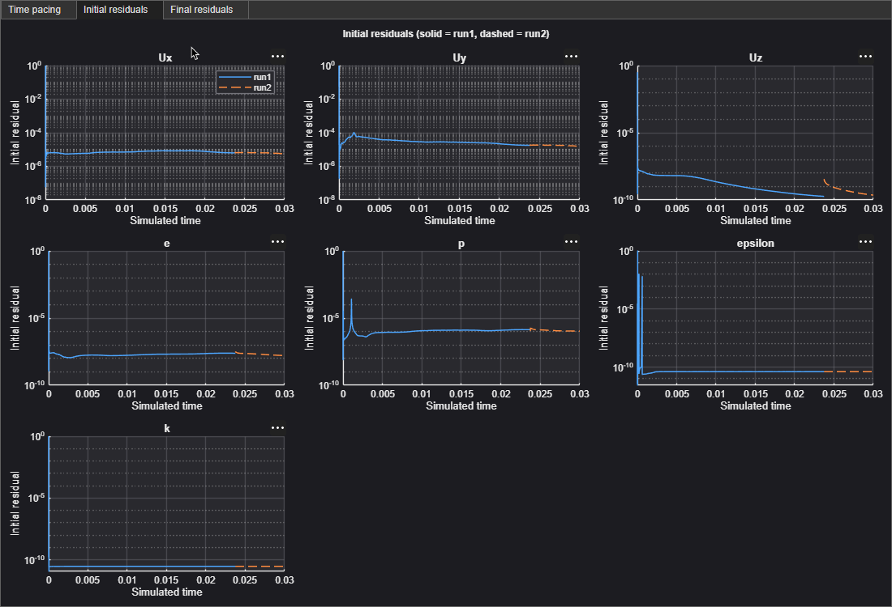</td>
<td>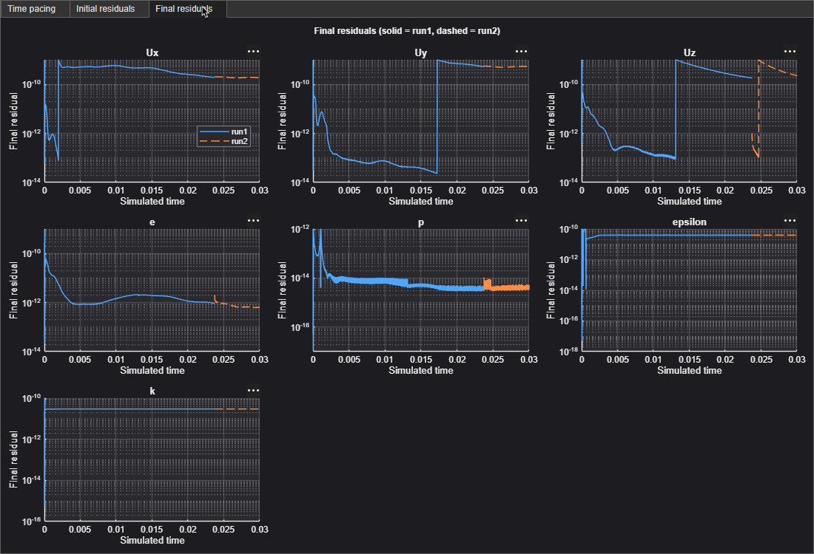</td>
</tr>
</table>

*Coarse mesh, run1 (solid) vs. run2 (dashed): initial residuals (left),
final residuals (right).*

### Engineering Challenges

Real dead ends, not just the final config:

- **A GPU linear-solver stack was built, then not shipped.** Built from
  source: CUDA-aware OpenMPI, PETSc (standard + CUDA-MPI), `petsc4Foam`,
  `foam2csr`, `amgx4Foam`, plus patches for known AmgX integration bugs.
  Production runs use OpenFOAM's native CPU `DILUPBiCGStab` — no `libs`
  entry for AmgX in the shipped `controlDict`. GPU path hit integration
  friction against this OpenFOAM version's API; CPU path shipped instead.
  (Same GPU-solver infrastructure is integrated on the race car project —
  see that case study.)
- **Solver choice pivoted mid-project.** Early setup used `rhoPimpleFoam`
  (transient PIMPLE, adjustable local timestepping). Final case moved to
  `sonicFoam`, fixed small timestep, explicit PISO — simpler and more
  robust for genuinely supersonic flow.
- **Mesh-quality issues tracked to specific cells.** An earlier pass had 9
  illegal faces at identifiable cell IDs; final pass: 0 illegal faces.

## Results

The number this process was built to produce, plus the checks that make it
trustworthy.

At t = 0.00492102 s, ρ∞ = 0.1714, l_ref = 1.974 m, A_ref = 0.0791 m²
(body diameter ≈ 0.317 m):

| Coefficient | Value |
|---|---|
| Cd (total) | 0.0310 |
| Cd, forward half | 0.0155 |
| Cd, rear half | 0.0155 |
| Cl, Cs, Cm (pitch/roll/yaw) | ≈ 0 (as expected) |

Drag splits evenly forward/rear; lift/side-force/moment ≈ 0, as expected for
an axisymmetric body at zero AoA. Cd holds at 0.0309–0.0310 (±0.0002) over
the final ~0.0008 s.

Coarse-mesh field renders at the same t = 0.00492102 s:

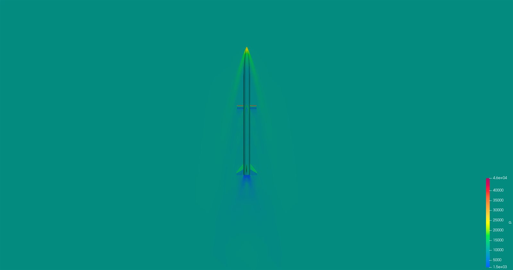

*Pressure: bow shock at the nose compresses flow to ~4.6×10⁴ Pa against a
1.06×10⁴ Pa freestream, consistent with the ~15.2° Mach angle
(asin(1/3.8115)) at this speed. Expansion around the shoulder and fin
leading edges drops local pressure toward ~1.5×10³ Pa before oblique shocks
off the fins recompress it.*

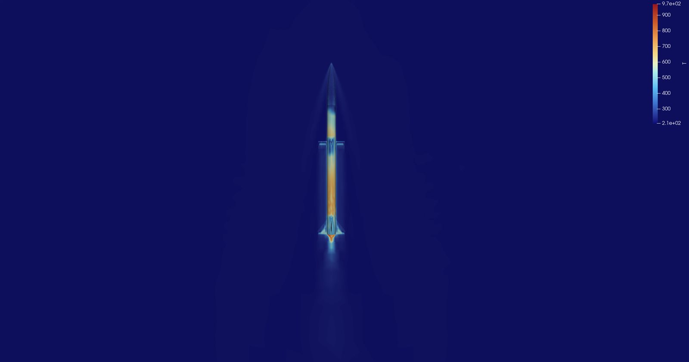

*Temperature: freestream 216.65 K rises to ~970 K at the nose and fin
leading edges — above the ~846 K isentropic stagnation estimate
(T∞·(1+0.2·M²)), the gap being real shock and viscous heating the
isentropic estimate doesn't capture.*

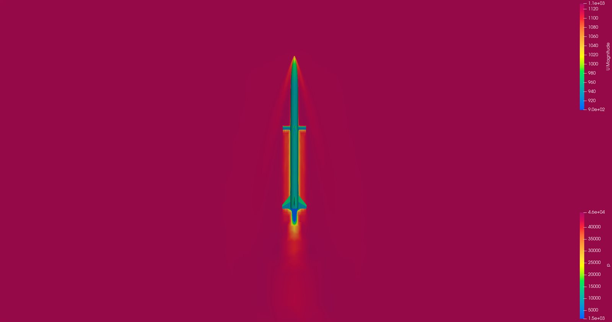

*Velocity/density: velocity drops to near-zero at the stagnation point and
through the wall boundary layer, freestream ~1125 m/s elsewhere; density
rises through the shock at the same locations pressure and temperature do,
consistent with the ideal gas relation between the three fields.*

> Flight condition (Mach/altitude) was read directly from a time-resolved
> ascent trajectory model, not picked as a round test number — the result
> reflects a specific point in a modeled flight profile.

[← Back to all projects](../README.md) · [Race Car Aero](../racecarAero/)
